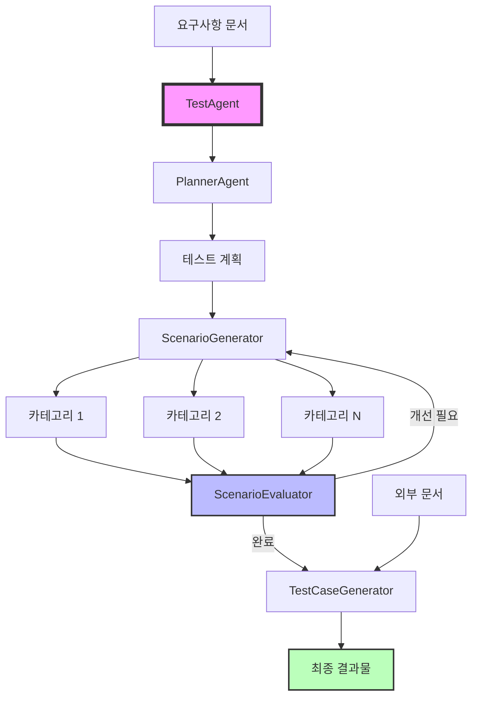
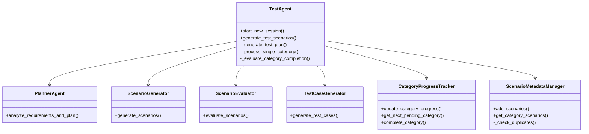
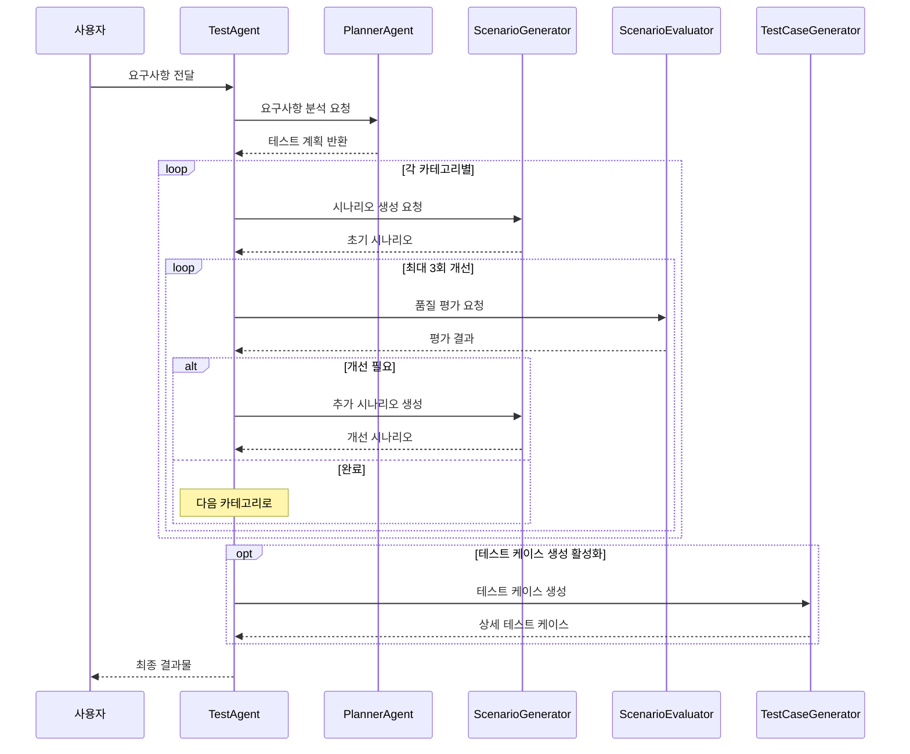

# 테스트 시나리오 자동 생성 시스템

대규모 언어 모델(LLM)을 활용한 종합적인 테스트 시나리오 및 테스트 케이스 자동 생성 시스템입니다.

## 📋 목차
- [주요 기능](#주요-기능)
- [시스템 아키텍처](#시스템-아키텍처)
- [설치 방법](#설치-방법)
- [빠른 시작](#빠른-시작)
- [생성 프로세스](#생성-프로세스)
- [설정 옵션](#설정-옵션)
- [출력 구조](#출력-구조)
- [고급 사용법](#고급-사용법)

## 🚀 주요 기능

### 1. **자동 테스트 계획 수립**
- 요구사항 문서 분석
- 테스트 카테고리 자동 분류
- 우선순위 기반 계획 수립

### 2. **카테고리별 시나리오 생성**
- 카테고리별 집중 생성
- 병렬 처리로 빠른 생성
- 중복 자동 제거

### 3. **LLM 기반 품질 평가**
- AI가 시나리오 완성도 평가
- 부족한 부분 자동 파악
- 개선 제안 제공

### 4. **반복적 개선**
- 평가 결과 기반 자동 개선
- 최대 3회 반복 개선
- 점진적 품질 향상

### 5. **상세 테스트 케이스 생성**
- 시나리오 → 실행 가능한 테스트 케이스 변환
- 단계별 상세 액션 정의
- 예상 결과 명시

### 6. **외부 문서 통합**
- 화면 설계서 참조
- API 문서 반영
- UI 가이드라인 적용

## 🏗️ 시스템 아키텍처



### 핵심 컴포넌트



## 📦 설치 방법

### 요구사항
- Python 3.8 이상
- requests 라이브러리

### 설치
```bash
# 기본 라이브러리 설치
pip install requests

# PDF 처리를 원하는 경우 (선택사항)
pip install PyPDF2
```

## 🚀 빠른 시작

### 기본 사용법

```python
from agents import TestAgent

# 에이전트 초기화
agent = TestAgent(
    api_key="your-api-key",
    output_dir="./test_output",
    log_level="INFO"
)

# 요구사항 정의
requirements = """
온라인 도서관 관리 시스템 요구사항:

1. 사용자 인증 및 권한
   - 이메일/비밀번호로 회원가입
   - 이메일 인증 필수
   - 역할별 권한 (학생, 교직원, 관리자)
   
2. 도서 검색 및 조회
   - 제목, 저자, ISBN으로 검색
   - 카테고리별 필터링
   - 도서 상세정보 및 위치 확인
"""

# 세션 시작 및 시나리오 생성
session_id = agent.start_new_session("도서관_시스템")
results = agent.generate_test_scenarios(requirements)

print(f"생성된 시나리오 수: {results['total_scenarios']}개")
```

## 🔄 생성 프로세스



### 단계별 설명

#### 1단계: 테스트 계획 수립
```
입력: 요구사항 문서
처리: 시스템 분석, 카테고리 분류, 우선순위 설정
출력: 구조화된 테스트 계획
```

#### 2단계: 카테고리별 시나리오 생성
```
입력: 카테고리 정보, 요구사항
처리: 병렬 생성, 중복 제거, 품질 검증
출력: 카테고리별 테스트 시나리오
```

#### 3단계: 평가 및 개선
```
입력: 생성된 시나리오
처리: LLM 평가, 부족 영역 파악, 개선 시나리오 생성
출력: 개선된 시나리오 세트
```

#### 4단계: 테스트 케이스 생성
```
입력: 최종 시나리오, 외부 문서
처리: 상세 단계 생성, 테스트 데이터 정의
출력: 실행 가능한 테스트 케이스
```

## ⚙️ 설정 옵션

| 매개변수 | 설명 | 기본값 | 타입 |
|---------|------|--------|------|
| `api_key` | LLM API 키 | 필수 | str |
| `evaluator_api_key` | 평가용 별도 API 키 | api_key와 동일 | str |
| `planner_api_key` | 계획 수립용 별도 API 키 | api_key와 동일 | str |
| `output_dir` | 출력 디렉토리 경로 | ./test_scenarios | str |
| `timeout` | API 요청 타임아웃 (초) | 300 | int |
| `log_level` | 로깅 레벨 | INFO | str |
| `max_improvements` | 카테고리당 최대 개선 횟수 | 3 | int |
| `evaluation_bias_mitigation` | 평가 편향 완화 활성화 | True | bool |
| `evaluation_rounds` | 편향 완화를 위한 평가 라운드 수 | 3 | int |
| `test_case_generation` | 테스트 케이스 생성 활성화 | False | bool |
| `test_case_external_docs` | 테스트 케이스용 외부 문서 | [] | List[str] |

### 평가 편향 완화란?

LLM이 평가할 때 발생할 수 있는 편향을 줄이는 기법입니다:

- **순서 편향**: 리스트 앞쪽 항목을 더 중요하게 평가
- **최근성 편향**: 마지막에 본 내용에 가중치
- **확증 편향**: 첫 인상에 따른 전체 평가

```python
# 편향 완화 활성화 (3배 느리지만 더 공정)
evaluation_bias_mitigation=True
evaluation_rounds=3  # 3회 평가 후 평균

# 편향 완화 비활성화 (빠르지만 편향 가능)
evaluation_bias_mitigation=False
```

## 📁 출력 구조

```
test_scenarios/
└── 세션명_20240101_120000/
    ├── plan/                          # 테스트 계획
    │   ├── test_plan.json            # 전체 계획 (JSON)
    │   └── test_plan_summary.md      # 요약 (마크다운)
    │
    ├── scenarios/                     # 원본 시나리오
    │   └── category_scenarios.json    # 카테고리별 원본
    │
    ├── final_scenarios/               # 최종 시나리오
    │   ├── all_test_scenarios.json   # 전체 시나리오
    │   ├── standard_test_scenarios.json  # 표준 형식
    │   └── standard_test_scenarios.csv   # CSV 형식
    │
    ├── final_test_cases/              # 테스트 케이스
    │   ├── generated_test_cases.json # 상세 테스트 케이스
    │   └── generated_test_cases.csv  # CSV 형식
    │
    ├── evaluation_results/            # 평가 결과
    │   └── category_evaluations.json # 카테고리별 평가
    │
    └── test_generation_report.md      # 최종 보고서
```

## 🔧 고급 사용법

### 1. 외부 문서 연동

```python
agent = TestAgent(
    api_key="your-api-key",
    test_case_generation=True,
    test_case_external_docs=[
        "/path/to/화면설계서.pdf",
        "/path/to/API명세서.txt",
        "/path/to/UI가이드라인.pdf"
    ]
)
```

### 2. 맞춤 설정

```python
agent = TestAgent(
    api_key="your-api-key",
    max_improvements=5,              # 더 많은 개선 시도
    custom_batch_size=10,            # 배치당 시나리오 수
    evaluation_bias_mitigation=True, # 공정한 평가
    evaluation_rounds=5,             # 5회 평가
    timeout=600,                     # 10분 타임아웃
    log_level="DEBUG"                # 상세 로그
)
```

### 3. 특정 API 키 분리

```python
agent = TestAgent(
    api_key="general-key",
    planner_api_key="planner-specific-key",
    evaluator_api_key="evaluator-specific-key",
    testcase_api_key="testcase-specific-key"
)
```

## 📊 결과물 예시

### 테스트 시나리오
```json
{
  "scenario_id": "AUTH_001",
  "category": "사용자 인증 및 권한",
  "scenario_name": "이메일 회원가입 정상 플로우",
  "scenario_description": "신규 사용자가 이메일로 회원가입하고 인증을 완료하는 전체 과정",
  "steps": [
    "회원가입 페이지 접속",
    "이메일, 비밀번호 입력",
    "이메일 인증 메일 확인",
    "인증 링크 클릭",
    "로그인 시도"
  ],
  "expected_result": "회원가입 완료 및 정상 로그인"
}
```

### 테스트 케이스
```json
{
  "testcase_id": "TC_AUTH_001_01",
  "test_case": "이메일 회원가입 - 정상 케이스",
  "test_steps": [
    {
      "sequence": 1,
      "step": "브라우저에서 회원가입 페이지(/signup) 접속",
      "expected_result": "회원가입 폼이 표시됨"
    },
    {
      "sequence": 2,
      "step": "이메일 'test@example.com' 입력",
      "expected_result": "이메일 형식 검증 통과"
    }
  ],
  "precondition": "인터넷 연결, 최신 브라우저",
  "input_data": "test@example.com / Test1234!"
}
```

## 🤝 기여하기

이슈 제보나 개선 제안은 언제든 환영합니다!

## 📄 라이선스

MIT License
